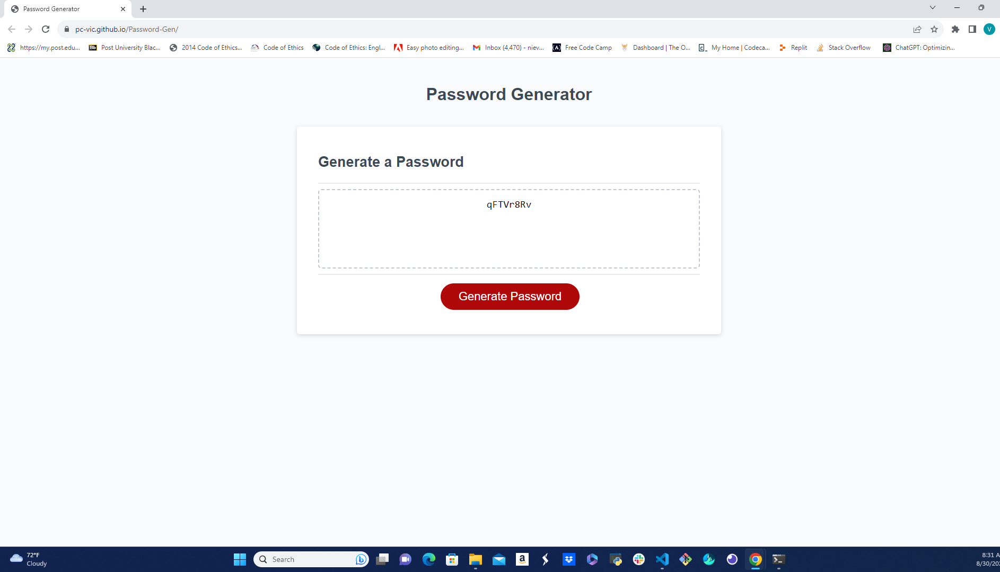

# Password Gen

A simple password generator built with JavaScript.

## Table of Contents

- [Password Gen](#password-gen)
  - [Table of Contents](#table-of-contents)
  - [Introduction](#introduction)
  - [Features](#features)
  - [Usage](#usage)
  - [Contact](#contact)

## Introduction

The Password Generator is a web application that allows users to generate secure passwords based on their preferences. It provides a user-friendly interface where users can customize password length and choose to include lowercase letters, uppercase letters, numbers, and special characters.

## Features

- Generate secure passwords with customizable options.
- Choose the length of the generated password.
- Include or exclude lowercase letters, uppercase letters, numbers, and special characters.

## Usage

1. Open the Password Generator in a web browser.
2. Adjust the settings based on your preferences:
   - Set the desired password length.
   - Check or uncheck the character options as per your requirements.
3. Click the "Generate Password" button to generate a password.
4. The generated password will be displayed on the screen.
5. Copy the password and use it as needed.

Link to deployed site:
https://pc-vic.github.io/Password-Gen/

## Contact

If you have any questions, suggestions, or feedback regarding the Password Generator, please feel free to contact me:

- Email: nievesvic86@gmail.com
- GitHub: PC-Vic https://github.com/PC-Vic/Password-Gen